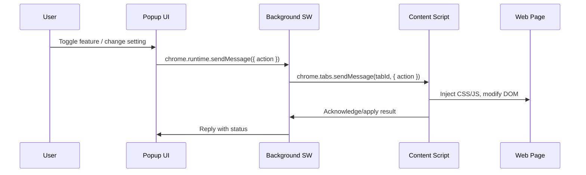
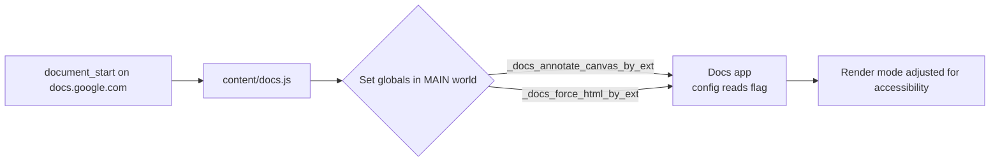
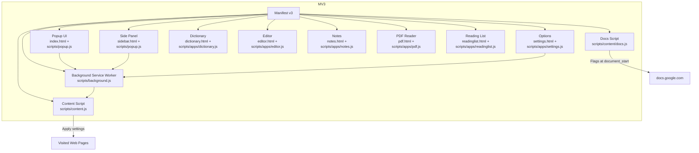
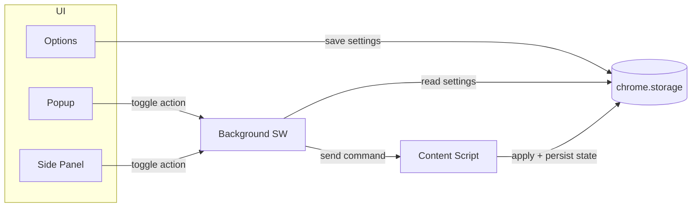

# Helperbird Extension – Codebase Explanation

Last updated: 2025-10-23

This document provides a structured walkthrough of the Helperbird browser extension codebase in `2025.10.13_0`, mapping its structure, core components, data flow, dependencies, patterns, critical logic, and open questions. It’s intended for onboarding and technical review.


## Project purpose (inferred)
Helperbird is an accessibility-focused browser extension offering reading/writing aids and utilities. It includes a popup UI, a side panel, and standalone feature pages (Dictionary, Editor, Notes, PDF reader, Reading List, Settings). Content scripts run on most sites to provide on-page features; there’s special handling for Google Docs.


## Structure map
Top-level of `2025.10.13_0/` (selected):

- HTML entry points
  - `index.html` – Action popup (Chrome toolbar button)
  - `sidebar.html` – Side panel default page
  - `settings.html` – Options UI (manifest `options_ui.page`)
  - App pages: `dictionary.html`, `editor.html`, `notes.html`, `pdf.html`, `readinglist.html`

- Scripts
  - `scripts/background.js` – Manifest service worker entry (currently empty in this build)
  - `scripts/content.js` – Generic content script injected on most pages (currently empty in this build)
  - `scripts/content/docs.js` – Google Docs integration flags (sets globals to control Docs rendering behavior)
  - `scripts/popup.js` – Popup/side panel bootstrap (currently empty in this build)
  - `scripts/google.js` – Web-accessible helper for Google surfaces (present, content not visible in this build)
  - App modules (loaded by their respective HTML pages):
    - `scripts/apps/dictionary.js`
    - `scripts/apps/editor.js`
    - `scripts/apps/notes.js`
    - `scripts/apps/pdf.js`
    - `scripts/apps/readinglist.js`
    - `scripts/apps/settings.js`
    (All currently empty in this build)
  - `674ab3f634efb574e7bc95b226ffa334.mjs` – Likely a bundled/compiled module (content not visible in this build)

- Assets
  - `assets/fonts/*` – Opendyslexic, Lexend, Lora
  - `assets/images/*` – Logos, cursors, base images
  - `assets/styles/style-engine.css`, plus style subfolders
  - ML/AI-related payloads exposed as web-accessible resources:
    - `assets/vosk/*`, `assets/scripts/vosk/*` – Vosk speech recognition models
    - `assets/wasm/*`, `assets/scripts/wasm/*`, `assets/scripts/lib/*` – WASM/lib payloads
    - `assets/scripts/traineddata/eng.traineddata.gz` – OCR trained data (Tesseract-like)

- Localization: `_locales/<lang>/messages.json` – i18n messages used in HTML titles and manifest
- Metadata: `_metadata/computed_hashes.json`, `_metadata/verified_contents.json` – Chrome Web Store integrity
- Config: `helperbird-config.json` – Managed storage schema for enterprise control
- Manifest: `manifest.json` – MV3 definition and permissions


## Manifest highlights (MV3)
- `action.default_popup`: `index.html`
- `background`: `{ module: true, service_worker: scripts/background.js }`
- `content_scripts`:
  - `scripts/content.js` on all URLs
  - Special: `scripts/content/docs.js` on `*://docs.google.com/*`, `run_at: document_start`, `world: MAIN`
- `options_ui.page`: `settings.html`
- `side_panel.default_path`: `sidebar.html`
- Permissions: `activeTab`, `storage`, `contextMenus`, `alarms`, `sidePanel`, `scripting`
- Host permissions: all URLs (`http://*/*`, `https://*/*`, `*://*/*`, `<all_urls>`)
- Web accessible resources include the HTML pages, scripts, models, WASM, and assets noted above
- Managed storage: `storage.managed_schema` -> `helperbird-config.json`
- CSP for extension pages: `script-src 'self'; object-src 'self'`


## Core components and relationships
- Background Service Worker (`scripts/background.js`)
  - Entry point for long-lived/background tasks, alarms, context menus, and message routing. In this build the file is empty, so logic is likely moved to a bundled module or omitted in this artifact.

- Content Scripts
  - General: `scripts/content.js` (empty in this build). Intended to inject UI/styles, listen for messages from the extension, and apply page-level accessibility features.
  - Google Docs: `scripts/content/docs.js` sets:
    ```js
    window._docs_annotate_canvas_by_ext = "ahmapmilbkfamljbpgphfndeemhnajme";
    window._docs_force_html_by_ext = "true";
    ```
    This suggests the extension toggles Docs rendering (canvas/HTML) for better accessibility and annotation.

- UI Surfaces (HTML + JS)
  - Popup: `index.html` + `scripts/popup.js`
  - Side panel: `sidebar.html` + `scripts/popup.js` (re-used)
  - Options: `settings.html` + `scripts/apps/settings.js`
  - Feature apps: `dictionary.html`, `editor.html`, `notes.html`, `pdf.html`, `readinglist.html` each loading their corresponding `scripts/apps/*.js`

- Google integration helper: `scripts/google.js` (web-accessible)
  - Likely used by content pages or injected frames to communicate with Google surfaces.

- Bundled module: `674ab3f634efb574e7bc95b226ffa334.mjs`
  - Likely contains the actual application logic compiled from a separate source (e.g., TypeScript/Vite/Rollup/webpack). Not readable in this build.

- Localization: `_locales/*/messages.json` used by `__MSG_key__` tokens in the HTML/manifest for titles and descriptions.

- Enterprise-managed config: `helperbird-config.json`
  - Schema defines `subKey` (license/subscription) and `isAdminControl` to lock down settings via managed storage.


## Data flow (intended patterns, with observed anchors)
Because most JS files are empty in this artifact, the flow below reflects standard MV3 practices combined with manifest wiring and the Docs flags we can see:

1. User interaction surfaces
   - Popup (`index.html`) and Side Panel (`sidebar.html`) initialize UI via `scripts/popup.js`. These UIs likely send commands to the background or directly to content scripts to apply features on the active tab.
   - Options (`settings.html`) manages preferences via `chrome.storage` (including enterprise-managed values), using `scripts/apps/settings.js`.

2. Content scripts
   - `scripts/content.js` is injected into all pages and would normally:
     - Read settings (from `chrome.storage`)
     - Inject CSS (e.g., `assets/styles/style-engine.css`) and modify the DOM for accessibility (fonts, color contrast, cursor sizes, focus outlines)
     - Listen for `chrome.runtime.onMessage` to apply effects on demand
   - Google Docs special handling at `document_start` with `world: "MAIN"` ensures flags are set on the page’s JS context before Docs app bootstraps.

3. Background service worker
   - Would typically orchestrate:
     - `chrome.contextMenus` for page actions
     - `chrome.alarms` for scheduled tasks
     - `chrome.scripting.executeScript` for on-demand injections
     - Message routing between popup/options and content scripts
   - In this artifact, the file is empty; logic could be compiled into the `.mjs` and dynamically imported.

4. Web-accessible resources
   - Assets (models, wasm, fonts) are declared WAR so content pages or injected iframes can fetch them. This setup supports on-device ML features (speech recognition via Vosk, OCR via traineddata) without external network calls.

### High-level sequence (typical)


### Google Docs boot flags



## External dependencies and services (inferred)
- Vosk Speech Recognition (offline) – via `assets/vosk/*` and `assets/scripts/vosk/*`
- OCR engine (Tesseract-like) – via `assets/scripts/traineddata/eng.traineddata.gz` and WASM libs
- WASM runtimes/libs – under `assets/wasm/*` and `assets/scripts/wasm/*`
- Chrome Extension APIs – MV3 (`storage`, `scripting`, `alarms`, `contextMenus`, `sidePanel`, etc.)
- Google Docs integration – via flags in `scripts/content/docs.js` and possibly `scripts/google.js`
- Localization – Chrome i18n messages via `_locales/*/messages.json`

No `package.json` or third-party JS library references are visible here; the compiled/bundled code is likely within the `.mjs` file.


## Coding patterns and practices
- MV3 extension architecture with clear separation of concerns:
  - Background SW, Content Scripts, UI Pages
- Multi-surface UI with small standalone HTML apps (SPA-like bootstraps per feature)
- Internationalization through Chrome `_locales`
- Enterprise governance via Managed Storage schema
- Use of Web Accessible Resources to support on-device ML features from content context
- Special-case integration with Google Docs at `document_start` in MAIN world to influence app boot behavior


## Critical logic, security, and performance considerations
- Broad host permissions: `*://*/*` and `<all_urls>` – carefully scope injections and guard message handlers to avoid affecting unintended pages.
- `world: MAIN` on Docs script – powerful but risky; ensure only benign globals are set and no prototype pollution/leaks.
- Web Accessible Resources – only expose what’s necessary; currently many pages and scripts are exposed which may increase the attack surface if embedded by third-party pages.
- Service Worker lifecycle – ensure background code (if compiled separately) handles SW suspension/resume; use `alarms`/events to reinitialize.
- On-device ML (Vosk/OCR) – large payloads; lazy-load and cache; monitor memory/CPU usage to maintain page performance.
- Storage model – respect managed settings (`isAdminControl`) to prevent user overrides where not allowed; sanitize imported settings.
- CSP – extension pages use `script-src 'self'`; avoid inline scripts unless hashed/allowed.


## Typical usage scenarios
- Popup/Side Panel: users toggle reading aids (font changes like OpenDyslexic/Lexend, cursors, themes), launch mini-apps (Dictionary, Notes, Editor), or adjust settings.
- Content script effects: dynamically apply styles, overlays, and interaction helpers on visited pages.
- Google Docs: force HTML mode or annotate canvas to improve accessibility and feature compatibility.
- PDF Reader: a dedicated page to open and annotate PDFs with accessibility features.
- Reading List: save and revisit URLs/articles.


## Documentation gaps and ambiguities
- Many core JS files are empty in this artifact (`background.js`, `content.js`, `popup.js`, `scripts/apps/*.js`). The actual logic likely resides in a bundled file (`674ab3f...mjs`) that’s not readable here. Without it, detailed function/class-level documentation isn’t possible.
- No build metadata (e.g., `package.json`, bundler config) present to explain how the `.mjs` is produced.
- No inline comments in the visible code except Docs flags.
- No README or developer setup guide.

### Questions to clarify
1. Where is the source code that produces `674ab3f634efb574e7bc95b226ffa334.mjs`? Which bundler/build tool is used?
2. Are `scripts/*.js` and `scripts/apps/*.js` placeholders that dynamically import from the `.mjs` at runtime?
3. What is the messaging contract between Popup/Side Panel, Background, and Content scripts (message types, schemas)?
4. Which features use Vosk and which use OCR? Any privacy constraints or offline-only requirements?
5. How are settings structured in `chrome.storage` (keys, defaults)? How do managed settings override user settings?
6. Are there analytics or telemetry components not present in this build?


## Visual aids

### Module relationships


### Data flow (settings and actions)



## Appendix – Key configuration files
- `manifest.json` – Defines extension entry points, permissions, content scripts, CSP, i18n, and web accessible resources.
- `helperbird-config.json` – Managed storage schema:
  - `subKey` (string) – Subscription/license key
  - `isAdminControl` (boolean) – Admin-enforced settings toggle


## Summary
This artifact provides the MV3 wiring, HTML surfaces, localized resources, and on-device ML assets, but it omits most executable logic (likely compiled into a bundled `.mjs`). We documented the architecture and expected data flows based on the manifest and page wiring, highlighted security/performance considerations, and listed targeted questions to recover the missing development context. Once the source/bundle is available, this document can be extended with concrete module APIs, message schemas, and function-level details.
