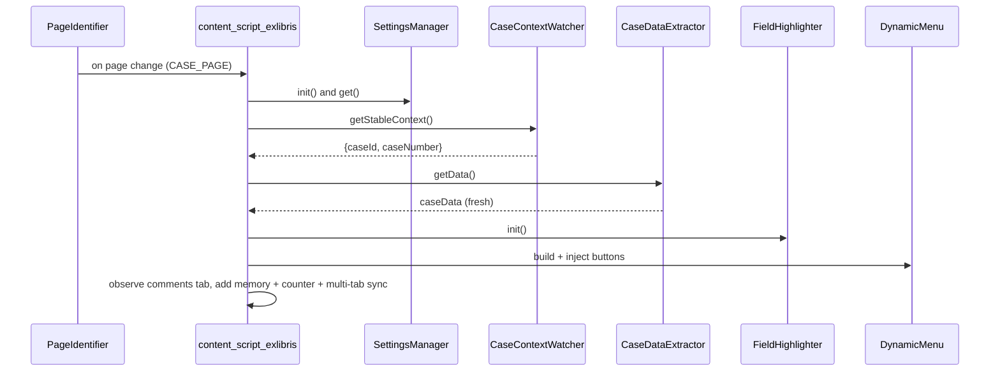
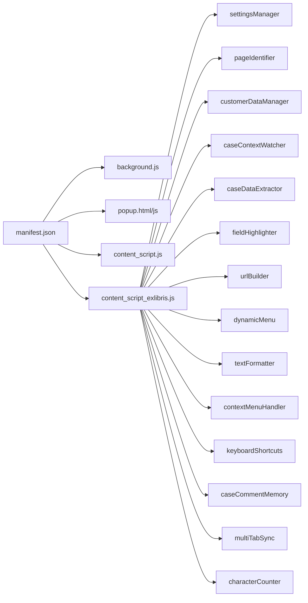

# Penang CoE CForce Extension — Deep-Dive Explanation

Date: 2025-10-23

## Overview

This document provides a high-level overview of the Chrome extension architecture, components, and workflows. For detailed information, see the focused documentation files:

- **[PROJECT_RULES.md](PROJECT_RULES.md)** - **START HERE** - Comprehensive project rules and agent guidelines for development
- **[BEST_PRACTICES.md](BEST_PRACTICES.md)** - Best practices, coding patterns, do's/don'ts, and lessons learned
- **[FUNCTIONS.md](FUNCTIONS.md)** - Complete function catalog with summary table and detailed documentation
- **[SELECTORS.md](SELECTORS.md)** - Centralized DOM selector registry with stability ratings and usage patterns
- **[DEPENDENCIES.md](DEPENDENCIES.md)** - Module dependency graph, data flow, and external API usage
- **[CHANGES.md](CHANGES.md)** - Structured change tracking with lessons learned

This document explains the architecture, components, data flow, dependencies, and critical logic of the Chrome extension. It also catalogs known gaps, patterns, and practical usage, and closes with a Development & Debugging Log. It's written to onboard new contributors quickly and to serve as a single source of truth.

## Structure and Components

Top-level entry points:
- `manifest.json` — Manifest V3 configuration: background service worker, action popup, domain-scoped content scripts, and permissions.
- `background.js` — Creates “Ex Libris Format” context menus, routes menu events to content scripts, saves/returns selected text, and supports tab switching for the same Case ID.
- `popup.html` / `popup.js` — Settings UI tabs for General, Ex Libris, Shortcuts, About; reads/writes settings to Chrome storage; displays storage usage; dynamic manifest version.
- `content_script.js` — Legacy behaviors reused on Clarivate and ProQuest domains (email From validation, case list row aging colors, status badge colorization); SPA-aware via observers.
- `content_script_exlibris.js` — Main controller for ProQuest domain; orchestrates all modules by page type (Case Page, Case Comments, Cases List).

Modules (in `modules/`):
- `settingsManager.js` — Default settings, deep-merge, get/set by path, export/import, cache clearing, change listeners.
- `pageIdentifier.js` — Classifies current page (CASE_PAGE, CASE_COMMENTS, CASES_LIST) via URL/DOM; watches SPA mutations and popstate.
- `customerDataManager.js` — Customer dataset (default list + stubs for scraping); exposes IDs/names.
- `caseContextWatcher.js` — Waits 500 ms after navigation, re-reads `document.title` + `window.location.href`, and emits a stable `{ caseId, caseNumber }` payload for all consumers.
- `caseDataExtractor.js` — Extracts core case fields and derives institution/server/region; integrates with `customerDataManager`.
- `fieldHighlighter.js` — Highlights key fields (e.g., empty fields red); MutationObserver with debounce; cleanup supported.
- `urlBuilder.js` — Builds Live View/Back Office/Sandbox/Tools/SQL/etc. URLs; DC→Kibana mapping; analytics refresh info; JIRA link.
- `dynamicMenu.js` — Injects grouped action buttons based on `urlBuilder` outputs; configurable placement (card actions, header details).
- `textFormatter.js` — Unicode text styles; case conversions; formatting detection/toggling; symbol list.
- `contextMenuHandler.js` — Receives context menu events from background; formats/inserts into active textarea/selection.
- `keyboardShortcuts.js` — Hotkeys for formatting and UI actions; requires active textarea; integrates with `textFormatter`.
- `caseCommentMemory.js` — Auto-saves textarea content per-case (throttled); restore/history UI; inactivity close; cleanup.
- `multiTabSync.js` — BroadcastChannel heartbeat across tabs for same case; banner+button to switch to other tab via background.
- `characterCounter.js` — 0/4000 counter near Save; color thresholds; removal support.
- `caseCommentExtractor.js` — Extracts comments/metadata and outputs XML/TSV; injects copy buttons with toasts. Not currently loaded for ProQuest by the manifest.

## Domain Targeting and Loading

- Clarivate domains load: `content_script.js`
- ProQuest domain loads: `content_script.js` + the full module stack + `content_script_exlibris.js`

This ensures legacy features (e.g., case list/status highlighting) are available on ProQuest (a previously documented gap).

## Data Flow and Lifecycles

- Settings lifecycle
   - Read: `SettingsManager.init()` reads/merges defaults with `chrome.storage.sync` values.
   - Update: Popup writes to `chrome.storage.sync` → content side can listen for changes or be manually refreshed.
- Case data lifecycle
   - `CaseContextWatcher` waits for a stable head context → `content_script_exlibris.js` calls `CaseDataExtractor.getData()` (always fresh until `CaseDataStore` ships) → extracted payload is broadcast via `casePageDataExtracted` for downstream consumers.
- UI lifecycle per page type
   - `PageIdentifier.monitorPageChanges(cb)` drives `handlePageChange`:
      - CASE_PAGE: wait for DOM readiness → field highlighting → email From validation (legacy `handleAnchors`) → dynamic menu injection → comment memory → character counter → multi-tab sync.
      - CASE_COMMENTS: comment memory + character counter.
      - CASES_LIST: reuse legacy `handleCases` (row aging) and `handleStatus` (badges), with a table MutationObserver.
- Context menu lifecycle
   - `background.js` creates nested menus (Style, Case, Symbols) on install/update.
   - Click → background forwards event → `contextMenuHandler` formats current selection via `textFormatter`.
- Multi-tab lifecycle
   - `multiTabSync` uses BroadcastChannel to detect same-case tabs and shows a banner; when clicked, background switches to the other tab.

### Sequence (Case Page)

## Dependencies

- Chrome APIs: `contextMenus`, `runtime`, `tabs`, `storage`, `activeTab`.
- Storage: `chrome.storage.sync` (user settings). `chrome.storage.local` is currently used only for legacy history features; the retired cache will be replaced by the in-memory `CaseDataStore`.
- SPA handling: MutationObserver + `popstate` watchers.
- No external NPM dependencies; everything is vanilla JS modules loaded via manifest.

## Critical Logic Highlights

- Case identity validation is now centralized in `CaseContextWatcher`, which reads the head elements (title + URL) after navigation settles. All extractors must wait for this signal before touching the DOM.
- Legacy feature reuse: On ProQuest, `content_script.js` must be included to provide `handleCases`, `handleStatus`, and `handleAnchors` used by the controller.
- Dynamic Menu composition is driven by `UrlBuilder.buildAllButtons(caseData, style, timezone)`, then injected by `DynamicMenu` into configurable locations.
- Context formatting is centralized: background builds menus; content side applies transformations through `TextFormatter` with robust style/case conversions.

## Coding Patterns and Practices

- Modular pattern with global objects (loaded via manifest) and a central controller (`content_script_exlibris.js`).
- Observer-driven SPA support: MutationObserver and URL change detection to re-apply behaviors as Salesforce re-renders.
- Throttling and cleanup: Components that observe or inject UI provide cleanup paths to avoid leaks on page changes.
- Defensive DOM selectors: Queries are tolerant of Lightning DOM structure; retry loops used for late-loading elements.

## Known Flaws / Gaps (after fixes in this commit)

- FIXED: Case data caching now defers to `CaseContextWatcher` + fresh extraction; the legacy `CacheManager` API (and its parameter issues) has been removed entirely.
- FIXED: Popup “About” version mismatch — now set dynamically from `manifest.version`.
- FIXED: Minor CSS typo (`h2 { h2 { ... }`) in `popup.html`.
- OPEN: `caseCommentExtractor.js` is not included on ProQuest in `manifest.json`. If its features are desired, it needs loading and light wiring.
- RISK: DOM selectors may break with Salesforce UI changes; tests/documentation should be kept current.

## Purpose and Usage

- Audience: Salesforce support engineers working across Clarivate/ProQuest instances.
- Value:
   - Visual cues (field/status/list aging), consistency (formatting tools), and productivity (dynamic buttons, keyboard shortcuts, auto-save, multi-tab warnings).
- How to use:
   - Install the extension (MV3). Open Salesforce case pages to enable features. 
   - Configure settings via the extension popup while on a Salesforce tab. 
   - Use context menu or keyboard shortcuts to format text.

## Documentation

### Focused Documentation Files

For detailed information on specific aspects of the codebase:

- **[FUNCTIONS.md](FUNCTIONS.md)** - Complete catalog of all functions across all modules with parameters, return types, complexity ratings, and detailed documentation for complex functions
- **[SELECTORS.md](SELECTORS.md)** - Centralized registry of all DOM selectors with module usage, page types, stability ratings, and best practices
- **[DEPENDENCIES.md](DEPENDENCIES.md)** - Module dependency graph, load order, data flow diagrams, and external API usage
- **[BEST_PRACTICES.md](BEST_PRACTICES.md)** - Comprehensive do's/don'ts, coding patterns, identified redundancies, inconsistencies, and refactoring opportunities
- **[CHANGES.md](CHANGES.md)** - Structured change tracking with categories, lessons learned, and related issues

### Additional Documentation

- **[ARCHITECTURE.md](ARCHITECTURE.md)** — diagrams and deep architecture details.
- **[FEATURE_SUMMARY.md](FEATURE_SUMMARY.md)** — feature list and quick steps.
- **[IMPLEMENTATION_GUIDE.md](IMPLEMENTATION_GUIDE.md)** — per-feature guidance and future enhancements.
- **[COMPLETE_FLOW_DOCUMENTATION.md](COMPLETE_FLOW_DOCUMENTATION.md)** — end-to-end flows and observer lifecycle.
- **[DEBUG_INSTRUCTIONS.md](DEBUG_INSTRUCTIONS.md)** — manual test steps and DOM checks.

### Documentation Gaps (and pointers)

- Gaps to consider filling:
   - Add explicit mapping of selectors used in Lightning pages with screenshots.
   - Add a testing matrix for common page variants and locales.
   - Add performance notes with thresholds for observers and cache TTL tuning.

## Diagrams

### High-level Architecture

## Development & Debugging Log

- Change/Attempt: Ensure legacy list features on ProQuest
   - Status/Outcome: Fixed — `manifest.json` loads `content_script.js` on ProQuest.
   - Failures Observed: Legacy functions not available previously.
   - Actual Root Cause: Script not loaded for ProQuest domain.
   - Fixes & Successful Attempts: Add `content_script.js` to ProQuest content scripts block.
   - Lessons Learned: When reusing legacy code across domains/instances, explicitly load it.

- Change/Attempt: Case data caching
   - Status/Outcome: `CacheManager` removed — controller now waits for `CaseContextWatcher` and performs a fresh extraction each time.
   - Failures Observed: Stale cache entries and API drift.
   - Actual Root Cause: Case ID validation lived in multiple places and could not keep up with SPA navigations.
   - Fixes & Successful Attempts: Retire the storage-heavy cache, rely on head-based validation, and plan for the lightweight `CaseDataStore`.
   - Lessons Learned: Centralize page validation before storing data; SPA timing breaks traditional caches quickly.

- Change/Attempt: Popup About version
   - Status/Outcome: Fixed — version rendered dynamically from manifest.
   - Failures Observed: Display mismatch (2.2 vs 4.0).
   - Actual Root Cause: Hardcoded string drifted from manifest.
   - Fixes & Successful Attempts: Replace with `chrome.runtime.getManifest().version`.
   - Lessons Learned: Source-of-truth patterns reduce maintenance errors.

- Change/Attempt: CSS selector issue in popup
   - Status/Outcome: Fixed — corrected `h2` rule.
   - Failures Observed: Invalid selector `h2 { h2 { ... }`.
   - Actual Root Cause: Typo.
   - Fixes & Successful Attempts: Remove nested `h2 {`.
   - Lessons Learned: Small UI errors can hide in static assets—linting/preview helps.

## Next Steps

- Decide whether to include `modules/caseCommentExtractor.js` on ProQuest in `manifest.json`; if enabled, ensure it’s initialized safely (idempotent UI injection, cleanup on page change).
- Add automated or scripted checks for selector presence to alert on Salesforce UI changes.
- Consider centralizing DOM selectors and adding type/selector tests.
- Optional: Add a lightweight telemetry/logging panel (disabled by default) to aid field debugging.

## Quality Gates

- Build: PASS (no build system for this MV3 extension; static assets only).
- Lint/Typecheck: N/A (no configured linter/TS; recommend adding ESLint for future work).
- Tests: N/A (no test harness present; consider adding a minimal DOM testing setup with jsdom for critical helpers).

---

If you spot discrepancies or want to enable additional features (like the comment extractor), see “Next Steps” and open an issue describing desired behavior and target pages.
