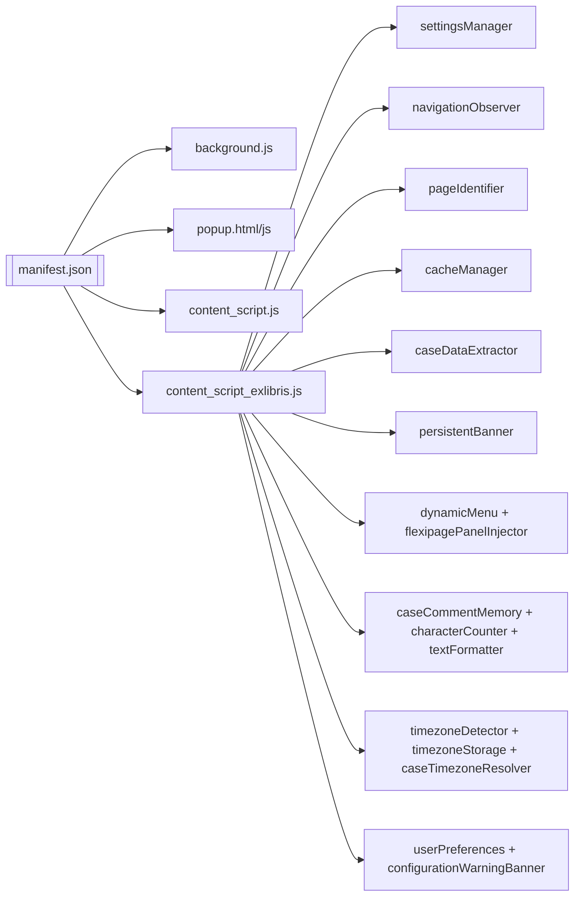
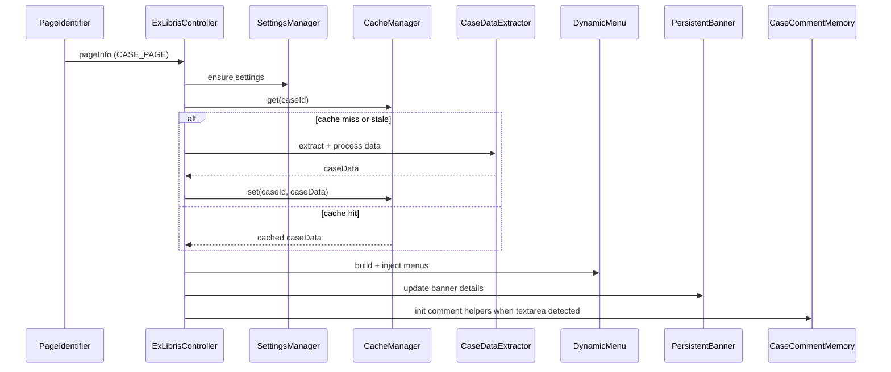

# Salesforce Support Extension Knowledge Capsule

Last updated: 2025-11-06

## 1. Project Purpose & Scope

- Manifest V3 Chrome extension that augments Salesforce Lightning/Console/Visualforce for Clarivate and ProQuest/Ex Libris case teams.
- Primary value: faster triage through dynamic environment links, field quality cues, comment tooling, timezone helpers, and persistent workflow banners.
- Supported hosts: `clarivateanalytics.lightning.force.com`, sandbox variants, `scholarone.my.salesforce.com`, and `proquestllc.lightning.force.com` (full feature set).

## 2. Repository Layout (key paths)

| Path | Description |
| --- | --- |
| `manifest.json` | MV3 manifest: declares background worker, content scripts, permissions, web accessible resources. |
| `background.js` | Service worker: builds context menus, relays menu actions, manages cross-tab focus, stores team selection. |
| `content_script.js` | Legacy script shared across Clarivate and ProQuest domains (status coloring, list highlighting, comms helpers). |
| `content_script_exlibris.js` | Main orchestrator for ProQuest domain; wires modules based on detected page type. |
| `popup.html` / `popup.js` | Browser action UI for configuring features, timezone, shortcuts, and shift data. |
| `modules/` | Feature modules (data extractors, UI injectors, storage helpers, timezone stack, observers, utilities). |
| `modules/styles/` | CSS injected for the flexipage panel and persistent banner. |
| `icons/` & `img/` | Extension icons and popup background asset. |
| `.github/` | Process documentation used during previous phases. |
| `INSTITUTION_DETAILS.csv` | Reference dataset for customer/server resolution. |

## 3. Runtime Architecture Overview

- **Background layer**: `background.js` runs as MV3 service worker. Handles install/update hooks, context menu tree, saved team selection, and tab switching support.
- **Popup layer**: `popup.js` reads/writes `chrome.storage.sync` + `chrome.storage.local` to expose settings dashboards, storage usage, and version info.
- **Content layer**: Scripts declared in `manifest.json` inject into target pages.
  - Clarivate domains: only `content_script.js`.
  - ProQuest domain: `content_script.js` plus all modules and `content_script_exlibris.js` for full toolkit.
- **Module pattern**: Each file in `modules/` registers a global singleton (to support MV3 script loading order). `content_script_exlibris.js` checks for module presence before calling APIs and gracefully degrades if disabled.

## 4. Core Components & Responsibilities

### Entry points

- `content_script_exlibris.js`: Detects page type with `PageIdentifier`, manages lifecycle (init, cleanup), coordinates caching, menu injection, banners, comment features, and timezone helpers.
- `content_script.js`: Provides legacy functionality (case list aging colors, status badge gradients, anchor handling, initial comment tooling) still required by controller.
- `background.js`: Owns the right-click menu grammar and cross-tab coordination.

### Data extraction & caching

- `caseDataExtractor.js`: Scrapes Lightning DOM for case metadata, normalizes text, resolves customer data via `CustomerDataManager`, and infers server + region.
- `casePageDataExtractor.js`: Automates prepare-tools flow; publishes structured payloads consumed by banners and menus.
- `caseDetailExtractor.js` & `caseCommentExtractor.js`: Additional deep scrapes (comment history, metadata) with visibility guards.
- `cacheManager.js`: Persists case payloads with signature hash of critical fields (status, sub-status, category, analysis note) to detect staleness; stores in `chrome.storage.local` with memory mirror.
- `customerDataManager.js`, `institutionTimezoneManager.js`, `accountAddressExtractor.js`: Provide dataset lookups and fallbacks when Salesforce fields are missing.

### UI injection & workflow helpers

- `dynamicMenu.js`: Builds grouped action buttons using `urlBuilder.js`; supports multiple mount points and re-injects after Salesforce DOM refreshes.
- `flexipagePanelInjector.js`: Renders the collapsible case toolkit panel when requested from the banner.
- `persistentBanner.js`: Shows fixed status bar with navigation shortcuts, case metadata, and entry points for panel injection.
- `fieldHighlighter.js`: Highlights mandatory or empty fields; respects feature toggle.
- `configurationWarningBanner.js`: Warns users when preferences are incomplete.

### Comment productivity stack

- `caseCommentMemory.js`: Auto-saves comment drafts per case with throttle, handles restore UI.
- `characterCounter.js`: Displays remaining characters next to Save, color-coded by thresholds.
- `contextMenuHandler.js` + `textFormatter.js`: Apply Unicode formatting, case transformations, and special symbols from context menu and keyboard shortcuts.
- `keyboardShortcuts.js`: Registers hotkeys, conditionally enabled via settings.
- `multiTabSync.js`: Uses BroadcastChannel heartbeat to detect duplicate case tabs and coordinate focus via background API.
- `shadowTextExtractor.js`: Helps pull text from shadow DOM fields (Lightning inputs).

### Timezone & shift management

- `timezoneDetector.js`, `caseTimezoneResolver.js`, `addressTimezoneResolver.js`, `institutionTimezoneManager.js`: Determine case-specific and user shift timezones using stored preferences plus institution metadata.
- `timezoneStorage.js`, `timezoneUtils.js`, `userPreferences.js`: Persist manual overrides, compute next analytics refresh windows, and expose helpers to other modules.

### Infrastructure utilities

- `settingsManager.js`: Deep-merges defaults, toggles features, exports/imports settings, reports quota usage.
- `navigationObserver.js`: Hooks History API, title, and hash mutations to surface SPA route changes quickly.
- `debounceUtils.js`, `eventSimulator.js`, `scrollController.js`, `toolsPanelManager.js`, `unknownCustomerManager.js`, `urlChangeMonitor.js`: Misc. helpers for throttling, simulated clicks, viewport adjustments, staged UI, fallback lookups, and extra navigation detection.

## 5. Data & Control Flow

### Case Page flow (happy path)

1. `NavigationObserver` or Lightning mutation triggers `PageIdentifier.monitorPageChanges`.
2. `content_script_exlibris.js` debounces, cleans prior injections, and records URL.
3. Settings load (`SettingsManager`, `UserPreferences`), banner updates stub data, and field highlighting kicks in if enabled.
4. `CacheManager.get(caseId)` checks signature; if stale/missing, `CaseDataExtractor.extractCaseData()` + `processData()` run, optionally enriched by `CustomerDataManager`.
5. Fresh payload written back via `CacheManager.set`. Toolkit context updated.
6. `URLBuilder.buildAllButtons()` generates action definitions reviewed by `DynamicMenu`, which injects into header/card slots (visibility checked).
7. `PersistentBanner` refreshes case metadata and exposes panel injection controls; `FlexipagePanelInjector` provisions panel on demand.
8. Comment modules initialize when communication tab or editor appears (Check-Then-Observe pattern), attach auto-save, counters, and formatting hooks.
9. Timezone helpers compute analytics refresh windows, shift info, and display inside banner/panel.

### Other flows

- **Case Comments page**: Skips extraction, but initializes comment memory, counters, and formatting once textarea appears. Observers stop when leaving page.
- **Case list view**: Falls back to legacy `handleCases` / `handleStatus` color coding from `content_script.js`, with MutationObserver to handle infinite scroll.
- **Context menu**: User selection -> `background.js` menu click -> message to active tab -> `contextMenuHandler.applyFormatting()` -> updates DOM selection preserving caret.

## 6. External Dependencies & Integrations

- **Chrome APIs**: `chrome.contextMenus`, `chrome.runtime`, `chrome.storage.sync`, `chrome.storage.local`, `chrome.tabs`, `chrome.action`, `chrome.scripting` (indirect via MV3 injection).
- **Salesforce Lightning DOM**: Relies on specific Lightning web components and attributes (`records-record-layout-item`, `lightning-formatted-text`, etc.).
- **Ex Libris endpoints**: URLs generated for live view, back office, sandboxes, and Kibana instances based on case data.
- **Dataset**: `INSTITUTION_DETAILS.csv` provides fallback server/institution metadata consumed by customer/timezone managers.
- **No third-party libraries**: All code is vanilla JavaScript/CSS/HTML.

## 7. Coding Patterns & Best Practices

- **Check-Then-Observe**: Always query once, then attach a MutationObserver with disconnect after success when waiting for Salesforce DOM.
- **Visibility filtering**: Use helpers that confirm `getBoundingClientRect()` dimensions and computed styles before injecting UI or extracting data (prevents hidden-tab issues).
- **Debounce + cleanup**: Page changes are debounced (100-800ms windows), observers and timers are torn down during cleanup to avoid leaks across SPA navigation.
- **Signature-based caching**: `CacheManager` uses concatenated status/category fields to detect changes instead of relying solely on timestamps.
- **Dataset fallbacks**: Derive `server`, `custID`, `instID`, and `institutionCode` from customer dataset when Salesforce fields are blank or inconsistent.
- **Data attributes for idempotence**: Mark injected elements (`dataset.exlibrisInjected`) and initialized textareas to prevent duplicate listeners.
- **Global singleton registry**: Modules expose singletons on `window` and guard calls with `typeof Module !== 'undefined'` to cope with optional loading in MV3.
- **User-driven observers**: Comment observers only start after users click "Create new" or similar, reducing background work.

## 8. Critical Logic & Hotspots

- **Case data integrity**: `CaseDataExtractor.processData()` harmonizes Salesforce field data with offline datasets; incorrect selectors break downstream menus and banners.
- **Cache invalidation**: Incorrect signature or missing highlight fields can lead to stale environment links. Always update both extractor and cache when adding tracked fields.
- **Dynamic menu injection**: Must re-run after Salesforce re-renders header (e.g., when user expands highlights). `DynamicMenu.observeHeaderSection()` handles reinjection—ensure changes keep observer disconnect/reconnect semantics.
- **Comment memory storage**: High-frequency auto-save to `chrome.storage.local`—respect throttles, and avoid unbounded history to stay within quota.
- **Navigation detection**: `NavigationObserver` overrides History API. When modifying, ensure original functions restored on cleanup to prevent memory leaks or breakage in host app.
- **Timezone calculations**: `URLBuilder.getNextAnalyticsRefresh()` assumes server region code correctness—double-check new regions or edition naming to avoid misleading SLA info.

## 9. Developer & AI Agent Do / Do Not

### Do

- Read this capsule then consult `LESSONS.md` for historical context before implementing.
- Follow Check-Then-Observe when touching DOM, and disconnect observers once solved.
- Update `CHANGE_TRACKER.md` with a concise log entry for every code/documentation change.
- Keep `copilot-instructions.md` synchronized with new best practices and surface notable lessons there.
- Run through ProQuest Lightning test paths (case page, comments view, list view) after modifying controllers or injectors.

### Do Not

- Inject UI without verifying element visibility or duplicate existence.
- Bypass `SettingsManager`/`UserPreferences` when introducing configuration toggles.
- Expand storage usage without reviewing `CacheManager` and popup quota indicators.
- Break global singleton pattern by redefining modules as ES modules—the MV3 load order depends on globals.
- Remove legacy `content_script.js` hooks from ProQuest block; the controller still calls legacy helpers.

## 10. Documentation & Knowledge Base

- **Single-source doc**: This `explaination.md` is now the authoritative condensed reference.
- **Historical docs**: The repo retains detailed phase notes under root `.md` files and `.github/` for audit trail. Reference as needed but update only when content materially changes.
- **Process alignment**: `copilot-instructions.md` mirrors key practices—keep it refreshed.
- **Document gaps**: No automated selector audit or test harness; consider adding DOM smoke tests. Some modules (e.g., comment extractor) are not wired for ProQuest—highlight before enabling.

## 11. Open Questions & Follow-ups

- Should `caseCommentExtractor.js` be re-enabled for ProQuest? Requires perf validation and UI QA.
- Need a single helper for visibility checks shared across modules to avoid drift.
- Evaluate adding ESLint or unit tests (jsdom) for critical utilities (cache, formatter).

## 12. Latest Lessons (2025-11-06)

- Centralizing documentation reduces onboarding time; this file supersedes scattered phase notes for day-to-day development.
- Maintaining a change log (`CHANGE_TRACKER.md`) alongside lessons creates accountability for both human and AI contributors.
- Revisiting `copilot-instructions.md` after architectural updates ensures coding agents honor current guardrails.

Refer to `CHANGE_TRACKER.md` for the activity log tied to this update.
