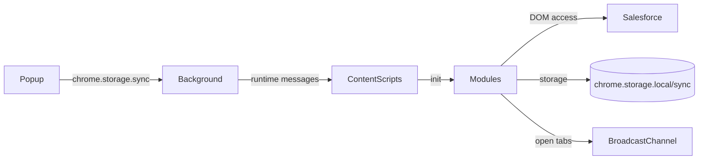
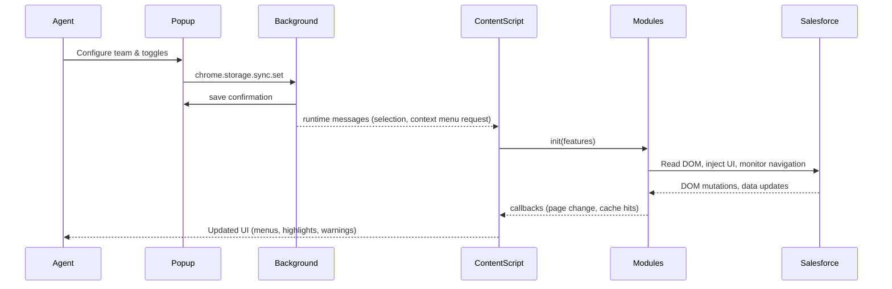

# Codebase Explanation & Fix Notes

## 1. Project Purpose and Overview

Penang CoE CForce Extension is a Chrome (Manifest V3) add-on that augments Clarivate and ProQuest Salesforce Lightning consoles. It improves agent workflows by highlighting critical case data, injecting quick-action buttons, synchronising multi-tab edits, auto-saving comments, formatting text, and surfacing institutional metadata. The repository supports multiple Salesforce tenants, retaining a legacy Clarivate script and a modular "Ex Libris" feature bundle for the ProQuest environment.

## 2. Directory and Key Assets

The extension ships as unpacked JavaScript, HTML, and CSS with no build tooling.

| Path | Role | Notes |
| --- | --- | --- |
| `manifest.json` | Extension manifest | Declares MV3 service worker, popup, permissions, per-domain content scripts, web resources. |
| `background.js` | Service worker | Creates context menus, relays storage messages, handles tab switching for multi-tab sync. |
| `popup.html`, `popup.js` | User settings UI | Lets agents select teams, toggle Ex Libris features, manage cache, export/import settings. |
| `content_script.js` | Legacy content script | Runs on Clarivate/Sandbox/ScholarOne domains; handles email validation, case list highlighting, status badges. |
| `content_script_exlibris.js` | Ex Libris orchestrator | Loads on `proquestllc.lightning.force.com`, coordinates modular features. |
| `modules/` | Feature modules | Encapsulates data extraction, caching, UI injections, keyboard shortcuts, logging, etc. |
| `modules/styles/injected-panel.css` | Shared stylesheet | Styles the Flexipage panel injected by the Ex Libris bundle. |
| `.github/`, `.reference/` | Documentation archives | Historical guides, implementation plans, prior extension versions. |
| `*.md` in root | Phase reports & guides | Summaries of releases, bug fixes, architecture notes. |
| `saveSelection.js` | Legacy helper | Older popup script retained for reference; superseded by `popup.js`. |

## 3. Runtime Architecture and Data Flow

- **Popup → Background → Content Scripts:** The popup persists agent preferences (`chrome.storage.sync`) and triggers background events. The background worker caches the current team and maintains context menu definitions. Content scripts read preferences to adjust behaviour.
- **Content Script Orchestration:** On ProQuest, `content_script_exlibris.js` initialises shared modules, reacts to SPA navigation, and cleans up state between pages. Legacy `content_script.js` still runs alongside it to preserve older behaviours.
- **Modules:** Reusable utilities manage caching, formatting, DOM injections, and data extraction. Most expose `init` and `cleanup` hooks that the orchestrator controls.
- **Salesforce DOM Integration:** Data is read via Lightning selectors (including shadow DOM helpers) and drives injected UI overlays.
- **Storage:**
  - `chrome.storage.sync` holds lightweight user preferences (team, feature toggles, shortcut state).
  - `chrome.storage.local` caches heavier objects (case data, comment history, customer lists).

## 4. Component Deep Dive

### 4.1 Manifest and Service Worker

- `manifest.json` defines two content script stacks: the legacy bundle for Clarivate/ScholarOne endpoints and an extended bundle (legacy script plus modular loaders) for the ProQuest tenant. `modules/styles/injected-panel.css` is exposed as a web-accessible resource.
- **Permissions:** `storage`, `tabs`, `activeTab`, and `contextMenus`, enabling context menu formatting and tab enumeration for multi-tab synchronisation.
- `background.js` creates the "Ex Libris Format" context menu tree with Unicode preview labels, persists the selected team, responds to `getSavedSelection`, and services `switchToOtherTab` requests from `multiTabSync`.

### 4.2 Popup

- `popup.html` provides tabbed settings (General, Ex Libris, Shortcuts, About) with descriptive UI copy.
- `popup.js` merges storage data with defaults, saves updates, exports/imports JSON, and displays storage utilisation. It hides configuration when the active tab URL is not a recognised Salesforce domain.

### 4.3 Legacy Content Script (`content_script.js`)

- Validates the email "From" selector, flagging non-Clarivate senders (red) or cross-team keywords (orange) based on saved team choices.
- Computes case age from table timestamps to colour rows according to SLA thresholds.
- Re-skins case status badges and relies on `MutationObserver` plus URL change detection to re-run handlers during Lightning SPA navigation.

### 4.4 Ex Libris Orchestrator (`content_script_exlibris.js`)

- Initialises `Logger`, `SettingsManager`, `CustomerDataManager`, `CacheManager`, and `NavigationObserver`, logging status per module.
- Subscribes to `PageIdentifier.monitorPageChanges` to detect Case detail, Case Comments, and Case list contexts.
- On Case pages it retrieves data via `CaseDataExtractor` (with cache fallback), applies `FieldHighlighter`, reuses legacy email validation, injects dynamic menus (`DynamicMenu` + `URLBuilder`), starts `CaseCommentMemory`, `CharacterCounter`, `MultiTabSync`, and updates the `FlexipagePanelInjector` summary labels.
- On Case Comments pages it reuses comment memory and the counter; on Case lists it defers to legacy handlers.
- Implements cleanup on navigation by disconnecting observers, removing DOM injections, and tearing down modules.

### 4.5 Modules Snapshot

| Module | Responsibility | Key Interactions |
| --- | --- | --- |
| `logger.js` | Namespaced logging with optional debug and performance timers | Used by orchestrator and heavy operations |
| `settingsManager.js` | Sync preference loader/saver with deep merge and listeners | Called by popup, orchestrator, feature toggles |
| `cacheManager.js` | Case data cache with last-modified validation and storage trimming | Consulted by `content_script_exlibris` before re-extracting data |
| `customerDataManager.js` | Embedded Esploro customer dataset with optional scraped override | Supplies `custID`, `instID`, `server` metadata |
| `caseDataExtractor.js` | Reads Lightning DOM fields and derives metadata | Feeds `URLBuilder`, panel context, caching |
| `fieldHighlighter.js` | Colours required Lightning fields with mutation debouncing | Triggered on case pages |
| `urlBuilder.js` | Generates production/sandbox URLs, Kibana links, analytics refresh times | Inputs to `DynamicMenu` |
| `dynamicMenu.js` | Renders button groups into card actions and header slots | Driven by orchestrator settings |
| `caseCommentMemory.js` | Auto-saves textarea content and provides restore dropdown with preview | Hooks into Case detail/comments pages |
| `characterCounter.js` | Displays running character count for comment textarea | Works with `CaseCommentMemory` |
| `keyboardShortcuts.js` | Maps key combos to `TextFormatter` actions and UI triggers | Controlled by settings toggle |
| `contextMenuHandler.js` | Applies formatting to selections when context menu items are chosen | Collaborates with background menu tree |
| `textFormatter.js` | Performs Unicode transformations and case conversions | Used by shortcuts and context menu |
| `multiTabSync.js` | BroadcastChannel-based duplication detector with warning banner and tab switch requests | Coordinates with background `switchToOtherTab` |
| `navigationObserver.js` | Hooks History API to detect Lightning SPA route changes | Notifies orchestrator |
| `timezoneDetector.js` | Detects locale/timezone for analytics refresh display | Used in menu and panel |
| `scrollController.js` | Incremental auto-scroll to trigger lazy-loading | Exposed through Flexipage panel |
| `flexipagePanelInjector.js` | Injects two-slot panel with control buttons (enable features, status, timezone, scroll) | Consumes case metadata and utility modules |
| `caseCommentExtractor.js` | Extracts comment tables, generates XML/TSV, injects copy buttons | Currently loaded but not initialised by orchestrator |
| `shadowTextExtractor.js`, `eventSimulator.js`, `implementationStatus.js` | Utilities and placeholders | Panel actions rely on these primitives; status checker remains TODO |

## 5. State, Storage, and Data Handling

- **Sync storage (`chrome.storage.sync`):** Stores `savedSelection` for email validation and nested `exlibris` preferences. `SettingsManager` deep merges defaults and surfaces helpers such as listeners, `toggleFeature`, and export/import utilities.
- **Local storage (`chrome.storage.local`):**
  - `CacheManager` persists case caches under the `caseCacheData` key with versioning and trimming (max 8 MB).
  - `CaseCommentMemory` saves per-case history (`caseCommentMemory`).
  - `CustomerDataManager` can persist scraped customer lists and active source metadata.
- **In-memory caches:** `CacheManager` mirrors storage in a `Map` to reduce reads; `CaseCommentMemory` tracks active entries and throttle timers per case.

## 6. External Dependencies and Integrations

- Chrome extension APIs: `chrome.storage`, `chrome.runtime`, `chrome.contextMenus`, `chrome.tabs`, `chrome.action`, and `chrome.runtime.onInstalled`.
- Web APIs: `BroadcastChannel`, `MutationObserver`, `Intl.DateTimeFormat`, `performance.now`, and DOM selection.
- Salesforce Lightning DOM conventions: heavy reliance on `records-record-layout-item` selectors, Lightning formatting tags, and `force` component classes; shadow DOM helper utilities are available for deeper traversal.
- No third-party libraries or bundlers; all logic is authored in vanilla JavaScript.

## 7. Coding Patterns and Practices

- Modules follow the revealing module pattern (IIFE returning a public API) for encapsulation.
- Feature toggles are centralised via `SettingsManager.isFeatureEnabled`, allowing dynamic enable/disable from the popup.
- SPA awareness is achieved through custom URL and mutation observers rather than Lightning-specific events.
- Formatting utilities leverage precomputed Unicode glyphs to satisfy MV3 restrictions on inline CSS.
- Legacy and new logic currently coexist, resulting in duplicated observers on case tables and email fields.

## 8. Critical Logic and Risk Register

| Severity | Area | Issue | Impact / Notes |
| --- | --- | --- | --- |
| **High** | Cache clearing | Popup "Clear Cache" and `SettingsManager.clearCache()` delete keys `caseData_*`/`caseDataCache`, but `CacheManager` stores data under `caseCacheData`. Cache cannot be purged from the UI, leading to stale data and storage growth. | Align keys or delegate cache clearing to `CacheManager.clearAll()`. |
| **Medium** | Flexipage panel context | `content_script_exlibris` passes `caseData.customer_id` and `caseData.institution_id`, but `CaseDataExtractor` exposes `custID`/`instID`. Panel shows an em dash instead of values. | Rename fields in extractor or adapt panel update call. |
| **Medium** | Case comment extractor | `caseCommentExtractor.js` is loaded yet never initialised (`initialize()` / `setupNavigationMonitoring()` not called). Copy buttons never appear and observers remain idle. | Wire module from orchestrator on relevant pages. |
| **Medium** | Event listener accumulation | `CaseCommentMemory.addRestoreButton()` attaches a document-level `click` listener each run. Repeated navigation may accumulate handlers. | Gate installation or remove the listener during cleanup. |
| **Medium** | Popup active tab guard | `popup.js` assumes `activeTab.url` exists. Opening on `chrome://` pages throws and blocks settings access. | Null-check active tab before string operations. |
| **Low** | Context menu creation | Background `onInstalled` and content scripts both request menu creation, causing redundant operations every load. | Consider relying on background-only creation. |
| **Low** | Implementation status feature | `implementationStatus.js` is a placeholder with default URL `https://your-status-tool-url.com`. Panel button leads to a dead end. | Hide button until an endpoint exists or document as future work. |
| **Low** | Customer data storage size | Embedded dataset plus optional scraped copy may approach `chrome.storage.local` quotas if duplicated. | Monitor size; trim fields or page scraped data. |

## 9. Open Questions and Clarifications

- Should the legacy `content_script.js` remain active on ProQuest alongside the modular stack, or can overlapping observers be retired?
Remain
- What is the authoritative source for implementation status? If none, should the panel action be hidden?
The panel should be disabled/grey-out for now, together with the checklist panel
- Should cache clearing also remove `customerListData` or other heavy storage entries?
No. Do not clear customer data on cache clear
- Are there plans to surface `CaseCommentExtractor` outputs beyond copy-to-clipboard (for example, file download)?
Yes, please keep a placeholder for future expansion.

## 10. Documentation Status

- Existing Markdown artifacts (`FEATURE_SUMMARY.md`, `IMPLEMENTATION_GUIDE.md`, `UPDATES_SUMMARY.md`) predate the current cache manager key naming and panel behaviour.
- `.github/DEVELOPER_GUIDE.md` describes modules but still states `caseCommentExtractor.js` is not loaded, which is now outdated.
- Update guides to reflect MV3 architecture, new storage keys, and any retired scripts.

## 11. Typical Usage Flow

1. Agent opens the popup on a Salesforce tab, selects their team, toggles features, and saves. Settings persist in sync storage.
2. On case pages, the Ex Libris bundle loads settings, extracts case metadata (with cache fallback), highlights required fields, injects quick access buttons, tracks multi-tab usage, and auto-saves comments.
3. Context menu entries and keyboard shortcuts offer Unicode formatting while typing.
4. During Lightning SPA navigation, observers trigger cleanup and reinitialisation to keep UI state fresh.

## 12. Visual Overview

## 13. Development & Debugging Log

| Change/Attempt Description | Status/Outcome | Failures Observed | Actual Root Cause | Fixes & Successful Attempts | Lessons Learned |
| --- | --- | --- | --- | --- | --- |
| Comprehensive codebase review and documentation pass | INVESTIGATION_COMPLETE | — | n/a | Generated `explanation-fix.md`; no code changes executed. | Documenting module wiring early surfaces storage/key mismatches before implementation work begins. |
