# Penang CoE CForce Extension — Comprehensive Codebase Analysis

**Last Updated:** 2025-12-18  
**Version:** 7.5.7  
**Author:** Codebase Analysis Engine

---

## Table of Contents

1. [Executive Summary](#executive-summary)
2. [Project Structure](#project-structure)
3. [Core Components & Relationships](#core-components--relationships)
4. [Data Flow & Lifecycles](#data-flow--lifecycles)
5. [Storage Architecture](#storage-architecture)
6. [Dependencies](#dependencies)
7. [Critical Logic & Complex Modules](#critical-logic--complex-modules)
8. [Coding Patterns & Practices](#coding-patterns--practices)
9. [Known Flaws, Gaps & Risks](#known-flaws-gaps--risks)
10. [Documentation Gaps](#documentation-gaps)
11. [Purpose & Typical Usage](#purpose--typical-usage)
12. [Visual Diagrams](#visual-diagrams)
13. [Related Documentation](#related-documentation)
14. [Development & Debugging Log](#development--debugging-log)

---

## Executive Summary

This Chrome Extension (Manifest V3) accelerates Salesforce Lightning case handling for Clarivate/ProQuest support engineers. It provides:

- **Dynamic action menus** with environment-specific links (Production, Sandbox, Kibana, SQL, JIRA)
- **Field highlighting** and **status badge colorization**
- **Persistent banner** with case metadata and timezone information
- **Comment auto-save** with memory/history
- **Multi-tab synchronization** warnings
- **Keyboard shortcuts** and **context menu formatting**
- **Workspace tools** (highlighter, sticky notes, bookmarks) for knowledge sites

The extension operates across three content script bundles:
1. **ProQuest/Clarivate Salesforce** — Full feature set with 75+ modules
2. **Non-Salesforce sites** — Workspace highlighter/notes/bookmarks tooling
3. **Background service worker** — Context menus, tab routing, backup alarms

---

## Project Structure

### Directory Tree

```
3.0/
├── manifest.json                    # MV3 manifest (v7.5.7)
├── background.js                    # Service worker: menus, routing, backups
├── content_script.js                # Legacy helpers (Clarivate + ProQuest)
├── content_script_exlibris.js       # Main ProQuest controller (~1167 lines)
├── content_script_highlighter.js    # Workspace tools controller (~3885 lines)
├── popup.html / popup.js            # Settings UI (~2036 lines)
├── sidepanel.html / sidepanel.js    # Side panel UI
│
├── modules/                         # 75+ feature modules
│   ├── [Infrastructure]
│   │   ├── logger.js                # Centralized logging with prefixes
│   │   ├── debounceUtils.js         # Debounce/throttle utilities
│   │   ├── settingsManager.js       # Settings read/write/merge/listeners
│   │   └── siteActivationManager.js # Feature gating per-site
│   │
│   ├── [Navigation & State]
│   │   ├── navigationObserver.js    # SPA navigation detection (5 signals)
│   │   ├── pageIdentifier.js        # Page type classification
│   │   ├── pageContextValidator.js  # Title + URL context validation
│   │   ├── caseContextWatcher.js    # Stable context resolution (500ms debounce)
│   │   └── caseDataStore.js         # Single source of truth (in-memory)
│   │
│   ├── [Data Extraction]
│   │   ├── caseDataExtractor.js     # Core field extraction
│   │   ├── casePageDataExtractor.js # Automatic case page scraping
│   │   ├── caseCommentExtractor.js  # Comment export (XML/TSV)
│   │   ├── caseDetailExtractor.js   # Detail tab extraction
│   │   ├── accountAddressExtractor.js # Account address parsing
│   │   └── shadowTextExtractor.js   # Shadow DOM text extraction
│   │
│   ├── [Customer & Timezone]
│   │   ├── customerDataManager.js   # Customer dataset management
│   │   ├── customerMasterManager.js # Master customer list
│   │   ├── customerTimezoneLookup.js # Timezone index lookup
│   │   ├── timezoneUtils.js         # Timezone conversion utilities
│   │   ├── timezonePopupWidget.js   # Timezone popup UI
│   │   └── addressTimezoneResolver.js # Address-based TZ resolution
│   │
│   ├── [UI Features]
│   │   ├── persistentBanner.js      # Case metadata banner (~9455 lines)
│   │   ├── dynamicMenu.js           # Action button injection
│   │   ├── fieldHighlighter.js      # Field highlighting with colors
│   │   ├── characterCounter.js      # 0/4000 comment counter
│   │   ├── configurationWarningBanner.js # Config warnings
│   │   └── flexipagePanelInjector.js # Flexipage panel injection
│   │
│   ├── [User Interaction]
│   │   ├── keyboardShortcuts.js     # Hotkey bindings
│   │   ├── contextMenuHandler.js    # Context menu event handler
│   │   ├── textFormatter.js         # Unicode text styling
│   │   ├── caseCommentMemory.js     # Comment auto-save/restore
│   │   └── multiTabSync.js          # Cross-tab synchronization
│   │
│   ├── [Workspace Tools]
│   │   ├── highlighter.js           # Text highlighting
│   │   ├── stickyNotes.js           # Sticky notes
│   │   ├── bookmarkManager.js       # Bookmark management
│   │   ├── screenshotManager.js     # Screenshot capture
│   │   ├── dataMigration.js         # Workspace backup/restore
│   │   └── storageQuotaManager.js   # Storage quota tracking
│   │
│   ├── [Interceptors]
│   │   ├── interceptor.js           # XHR interception (MAIN world)
│   │   ├── fetchInterceptor.js      # Fetch API interception
│   │   └── interceptorCacheManager.js # Intercepted data caching
│   │
│   └── [Utilities]
│       ├── urlBuilder.js            # URL construction for environments
│       ├── eventSimulator.js        # DOM event simulation
│       ├── scrollController.js      # Scroll behavior control
│       └── caseDomUtils.js          # DOM helper utilities
│
├── lib/                             # Third-party libraries
│   ├── DOMPurify.min.js             # HTML sanitization
│   ├── html2canvas.min.js           # Screenshot capture
│   └── fabric.min.js                # Canvas annotation
│
├── shared/                          # Shared utilities
│   ├── timezones_index.json         # Timezone mappings
│   ├── google-drive.js              # Google Drive backup
│   └── ai.js                        # AI integration helpers
│
├── preact-modules/                  # Preact UI components
│   ├── components/                  # Reusable components
│   ├── hooks/                       # React-like hooks
│   └── ui/                          # UI widgets
│
├── docs/                            # Documentation
│   ├── minimal-knowledge-base.md    # Quick reference cheat sheet
│   └── condensed-dev-guide.md       # Developer guide
│
├── icons/ & img/                    # Extension icons and images
├── modules/styles/                  # CSS for injected components
└── .github/                         # Copilot instructions
```

### Module Count by Category

| Category | Count | Key Modules |
|----------|-------|-------------|
| Infrastructure | 8 | logger, debounceUtils, settingsManager, navigationObserver |
| State Management | 5 | caseContextWatcher, caseDataStore, pageContextValidator |
| Data Extraction | 8 | caseDataExtractor, casePageDataExtractor, caseCommentExtractor |
| Customer/Timezone | 8 | customerDataManager, customerTimezoneLookup, timezoneUtils |
| UI Features | 10 | persistentBanner, dynamicMenu, fieldHighlighter, characterCounter |
| Workspace Tools | 8 | highlighter, stickyNotes, bookmarkManager, dataMigration |
| Utilities | 10 | urlBuilder, textFormatter, scrollController, eventSimulator |
| Interceptors | 3 | interceptor, fetchInterceptor, interceptorCacheManager |
| **Total** | **~75** | |

---

## Core Components & Relationships

### Component Architecture Diagram

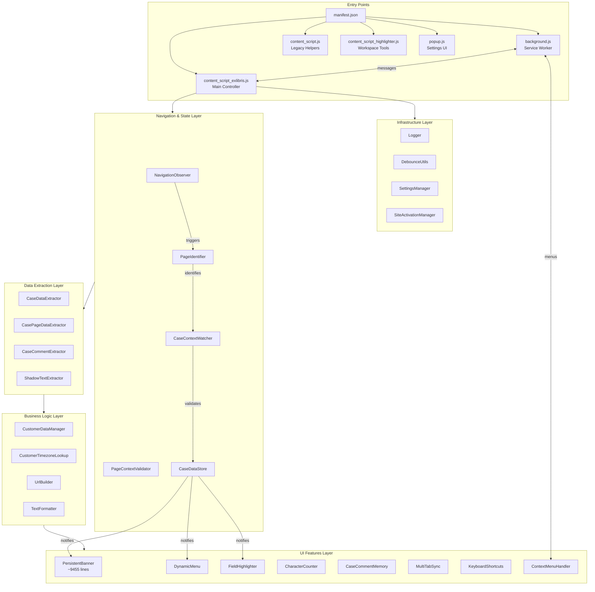

### Key Component Descriptions

| Component | Purpose | Key Methods | Dependencies |
|-----------|---------|-------------|--------------|
| **NavigationObserver** | Detects SPA navigation via 5 signals (title, history API, popstate, hashchange, DOM) | `start()`, `stop()`, `onRouteChange()`, `checkNavigation()` | None (core) |
| **PageIdentifier** | Classifies page type from URL patterns | `identifyPage()`, `monitorPageChanges()`, `getPageType()` | NavigationObserver |
| **CaseContextWatcher** | Resolves stable `{caseId, caseNumber}` after 500ms debounce | `init()`, `getStableContext()`, `subscribe()`, `getCurrentContext()` | NavigationObserver, PageContextValidator |
| **CaseDataStore** | Single source of truth for active case (in-memory, per-tab) | `init()`, `setCurrentData()`, `getCurrentData()`, `subscribe()`, `clear()` | CaseContextWatcher |
| **CasePageDataExtractor** | Automatic field extraction on case pages | `init()`, `handlePageChange()`, `extractAllCaseData()` | CaseContextWatcher, CaseDataStore, PageIdentifier |
| **PersistentBanner** | Displays persistent case metadata banner with actions | `init()`, `updateBannerUI()`, `handleStoreDataUpdate()` | CaseContextWatcher, CaseDataStore, SettingsManager |
| **DynamicMenu** | Injects grouped action buttons | `build()`, `inject()`, `getButtonData()` | UrlBuilder, SettingsManager |
| **FieldHighlighter** | Highlights key fields with configurable colors | `init()`, `highlight()`, `cleanup()` | CaseDomUtils |

---

## Data Flow & Lifecycles

### Primary Data Flow (Case Page)

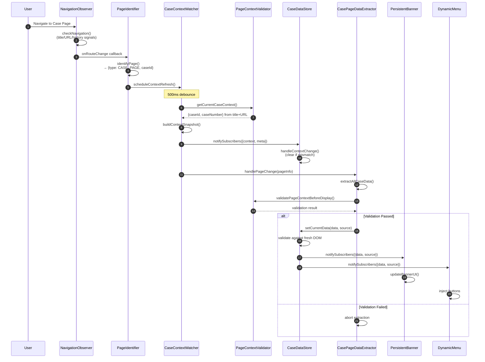

### Event Communication Map

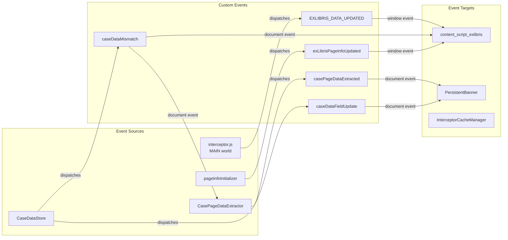

### Content Script Initialization Flow

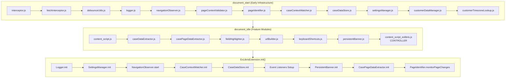

---

## Storage Architecture

### Three-Layer Storage Model

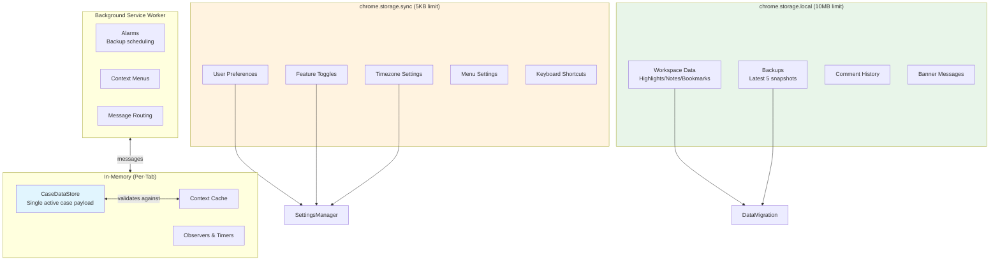

### Storage Keys Reference

| Storage | Key | Contents |
|---------|-----|----------|
| **sync** | `exl_settings` | Feature flags, UI preferences, cache settings |
| **sync** | `userSettings` | Legacy settings object |
| **local** | `exl_bannerMessages` | Banner message configuration |
| **local** | `exl_workspace_backup_*` | Workspace backup snapshots |
| **local** | `stickyNotes` | Sticky notes data |
| **local** | `highlighterData` | Text highlighting data |
| **local** | `bookmarks` | Bookmarks data |
| **local** | `commentHistory_*` | Per-case comment history |

### Background ↔ Content Script Communication

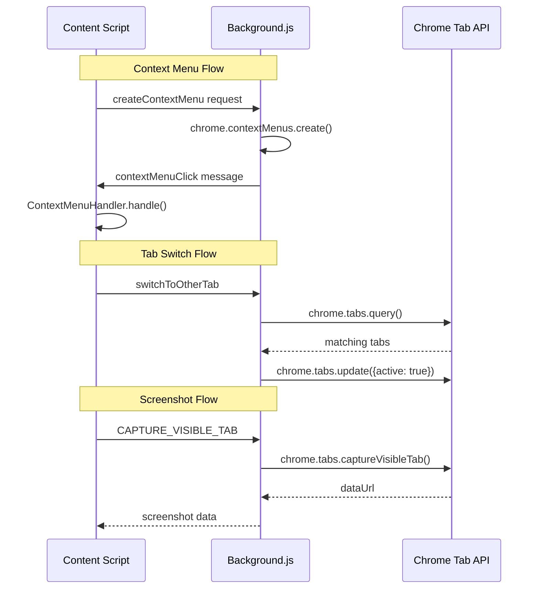

---

## Dependencies

### External Libraries

| Library | Version | Purpose | Location |
|---------|---------|---------|----------|
| **DOMPurify** | min | HTML sanitization for user input | `lib/DOMPurify.min.js` |
| **html2canvas** | min | Screenshot capture of DOM elements | `lib/html2canvas.min.js` |
| **fabric.js** | min | Canvas annotation and manipulation | `lib/fabric.min.js` |

### Chrome APIs Used

| API | Purpose | Modules Using |
|-----|---------|---------------|
| `chrome.contextMenus` | Right-click menu management | background.js, contextMenuHandler |
| `chrome.storage.sync` | User preferences (cross-device) | settingsManager, userPreferences |
| `chrome.storage.local` | Workspace data, backups | dataMigration, storageQuotaManager |
| `chrome.tabs` | Tab management, switching | background.js, multiTabSync |
| `chrome.runtime` | Message passing, lifecycle | All content scripts |
| `chrome.alarms` | Scheduled backup triggers | background.js |
| `chrome.identity` | OAuth for Google Drive | google-drive.js |
| `chrome.sidePanel` | Side panel UI | sidepanel.js |
| `chrome.tabCapture` | Screen recording | screenshotManager |

### Module Dependency Hierarchy

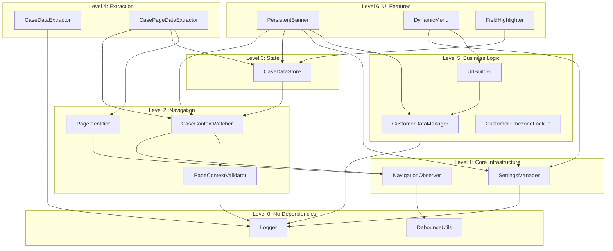

---

## Critical Logic & Complex Modules

### High-Complexity Modules

| Module | Lines | Complexity | Critical Functions |
|--------|-------|------------|-------------------|
| **persistentBanner.js** | ~9455 | Very High | Message rotation, timezone sync, customer metadata, status color mapping, navigation history |
| **content_script_highlighter.js** | ~3885 | High | Layer management, screenshot capture, sticky notes, bookmarks |
| **content_script_exlibris.js** | ~1167 | High | Module orchestration, event routing, page type handling |
| **popup.js** | ~2036 | Medium | Settings tabs, storage management, export/import |
| **casePageDataExtractor.js** | ~800 | Medium | Shadow DOM traversal, field extraction, validation |

### Critical Logic Patterns

#### 1. Check-Then-Observe Pattern (DOM Queries)

```javascript
// Query synchronously first
let element = document.querySelector(selector);
if (element) {
    processElement(element);
    return;
}

// Fallback to MutationObserver
const observer = new MutationObserver((mutations) => {
    element = document.querySelector(selector);
    if (element) {
        observer.disconnect(); // CRITICAL: Always disconnect
        processElement(element);
    }
});
observer.observe(document.body, { childList: true, subtree: true });
```

#### 2. Context-First Validation Pattern

```javascript
// ALWAYS validate context before DOM work
const context = await CaseContextWatcher.getStableContext({ requireCase: true });
if (!context) return; // Not on valid case page

// Re-validate after any async operation
const freshContext = CaseContextWatcher.getCurrentContext();
if (freshContext?.caseId !== context.caseId) {
    console.warn('Context changed during operation');
    return;
}
```

#### 3. Shadow DOM Traversal Pattern

```javascript
function queryShadowDOM(selector, root = document.body) {
    let element = root.querySelector(selector);
    if (element) return element;

    const traverse = (node) => {
        if (node.shadowRoot && node.shadowRoot.mode === 'open') {
            const found = node.shadowRoot.querySelector(selector);
            if (found) return found;
            for (const child of node.shadowRoot.children) {
                const result = traverse(child);
                if (result) return result;
            }
        }
        for (const child of node.children) {
            const result = traverse(child);
            if (result) return result;
        }
        return null;
    };

    return traverse(root);
}
```

#### 4. Interceptor Pattern (MAIN World Injection)

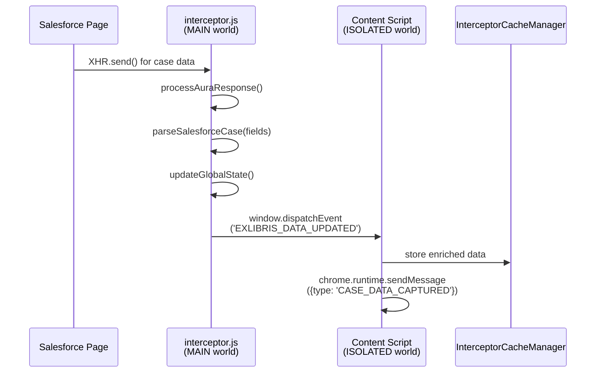

---

## Coding Patterns & Practices

### Module Patterns Used

| Pattern | Usage | Example Modules |
|---------|-------|-----------------|
| **IIFE** | Encapsulation with private state | CustomerDataManager, ContextMenuHandler, TimezoneStorage |
| **Object Literal** | Simple modules without private state | Logger, DebounceUtils, TextFormatter, FieldHighlighter |
| **Pub/Sub** | Event-based communication | CaseContextWatcher, CaseDataStore, NavigationObserver |
| **Observer** | DOM mutation watching | PageIdentifier, FieldHighlighter, NavigationObserver |

### Standard Module Template

```javascript
/**
 * ModuleName
 * Brief description of purpose
 */
const ModuleName = (function() {
  'use strict';

  // ========== PRIVATE STATE ==========
  let isInitialized = false;
  let observer = null;

  // ========== PRIVATE FUNCTIONS ==========
  function privateHelper() { /* ... */ }

  // ========== PUBLIC API ==========
  return {
    init() {
      if (isInitialized) return;
      // Initialization logic
      isInitialized = true;
    },

    cleanup() {
      if (observer) {
        observer.disconnect();
        observer = null;
      }
      isInitialized = false;
    }
  };
})();
```

### Key Practices

1. **Debouncing Strategy**
   - Navigation observers: 250ms
   - Context resolution: 500ms
   - Heavy DOM operations: 500ms+
   - Auto-save: Already debounced in feature modules

2. **Cleanup on Navigation**
   - Disconnect all MutationObservers
   - Clear all timers (`setTimeout`, `setInterval`)
   - Remove event listeners
   - Remove injected DOM elements (tagged with `data-exl-*`)

3. **Error Handling**
   - Wrap risky operations in try-catch
   - Log errors with `[ModuleName]` prefix
   - Fail gracefully, don't break entire extension

4. **Selector Strategy**
   - Use `field-label` attributes (most stable)
   - Use `data-*` attributes for custom elements
   - Avoid generated classes (`lwc-*`, `forcegenerated-*`)
   - Always check visibility before operating

---

## Known Flaws, Gaps & Risks

### Active TODOs in Codebase

| Location | TODO | Priority |
|----------|------|----------|
| `implementationStatus.js:11` | "TODO: Update with actual URL" | Low |
| `implementationStatus.js:23` | "TODO: Implement actual status checking logic" | Medium |
| `highlightsSidepanel.js:1057` | "TODO: Implement scroll-to-highlight functionality" | Low |

### Known Risks

| Risk | Severity | Mitigation |
|------|----------|------------|
| **Salesforce DOM churn** | High | Keep fallback selectors, monitor for breakage |
| **Long-lived observer leaks** | Medium | Ensure cleanup() called on navigation |
| **Timezone data drift** | Medium | Keep `timezones_index.json` updated |
| **Background worker termination** | Medium | Persist immediately after operations |
| **No automated tests** | High | Rely on manual Salesforce testing |

### Open Questions

1. Should `caseCommentExtractor.js` be loaded on ProQuest? (Currently excluded in manifest)
2. Are additional Salesforce orgs (sandbox/business units) planned?
3. What is the roadmap for `CaseDataStore` persistence beyond in-memory?

### Fixed Issues (Recent)

| Issue | Resolution | Lesson Learned |
|-------|------------|----------------|
| Legacy cache causing stale data | Removed `CacheManager`, use fresh extraction | Centralize page validation before storing |
| Popup version mismatch | Dynamic from `manifest.version` | Use source-of-truth patterns |
| CSS selector typo | Fixed `h2 { h2 {...}}` | Lint/preview static assets |
| Legacy features missing on ProQuest | Added `content_script.js` to manifest | Explicitly load reused code |

---

## Documentation Gaps

### Areas Needing Documentation

| Gap | Priority | Recommendation |
|-----|----------|----------------|
| **Selector screenshots** | Medium | Add visual mapping of Lightning DOM selectors |
| **Testing matrix** | High | Document page variants and locales to test |
| **Performance thresholds** | Medium | Document observer debounce values and cache TTLs |
| **UX specs for banner/menu** | Low | Capture current layouts before Salesforce changes |
| **Inline JSDoc coverage** | Medium | Some modules lack comprehensive JSDoc |

### Well-Documented Areas

- ✅ Architecture diagrams (ARCHITECTURE.md)
- ✅ Best practices and patterns (BEST_PRACTICES.md)
- ✅ Change tracking with lessons (CHANGES.md)
- ✅ Module dependencies (DEPENDENCIES.md)
- ✅ DOM selectors registry (SELECTORS.md)
- ✅ Function catalog (FUNCTIONS.md)

---

## Purpose & Typical Usage

### Target Audience

Salesforce support engineers working on:
- **ProQuest/Ex Libris** case management
- **Clarivate** support workflows
- **Knowledge sites** (support.clarivate.com, knowledge.exlibrisgroup.com)

### Value Proposition

| Feature | Benefit |
|---------|---------|
| **Dynamic action menus** | One-click access to environment URLs (Prod, Sandbox, Kibana, SQL, JIRA) |
| **Field highlighting** | Visual cues for empty/critical fields |
| **Persistent banner** | Case metadata always visible during navigation |
| **Comment auto-save** | Never lose work in progress |
| **Multi-tab sync** | Avoid conflicting edits across tabs |
| **Keyboard shortcuts** | Faster text formatting |
| **Workspace tools** | Annotate knowledge articles with highlights/notes |

### Installation & Usage

1. Install extension (Chrome MV3)
2. Navigate to Salesforce case pages
3. Configure settings via extension popup
4. Use context menu or keyboard shortcuts for formatting
5. Use workspace tools on knowledge sites

---

## Visual Diagrams

### Complete System Architecture

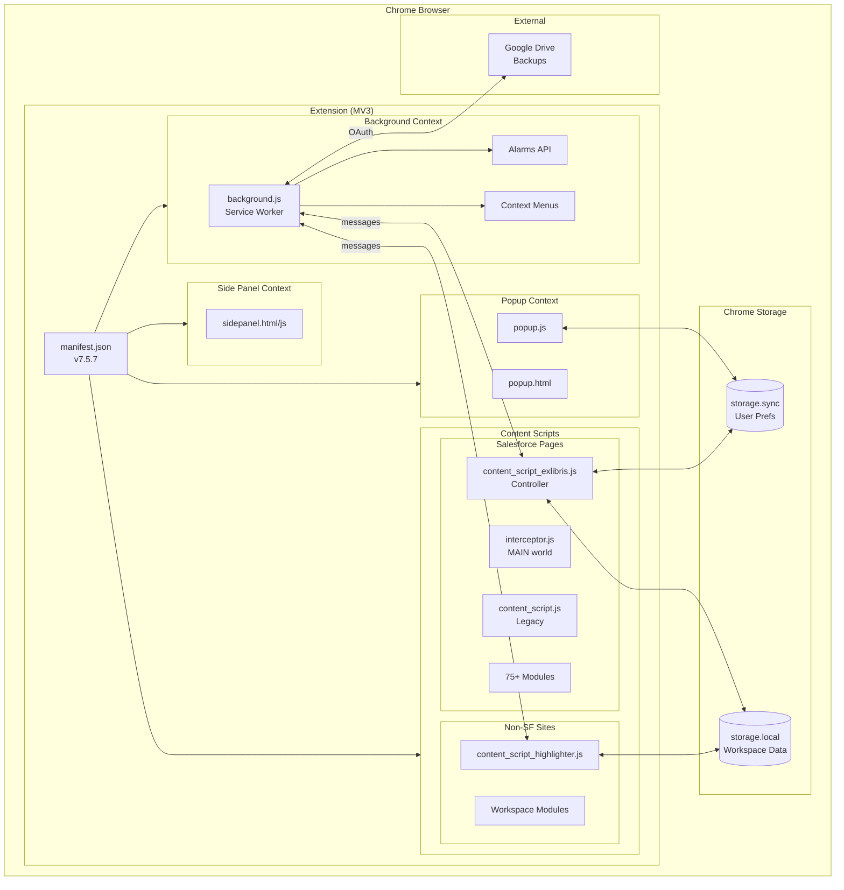

### Page Type Routing

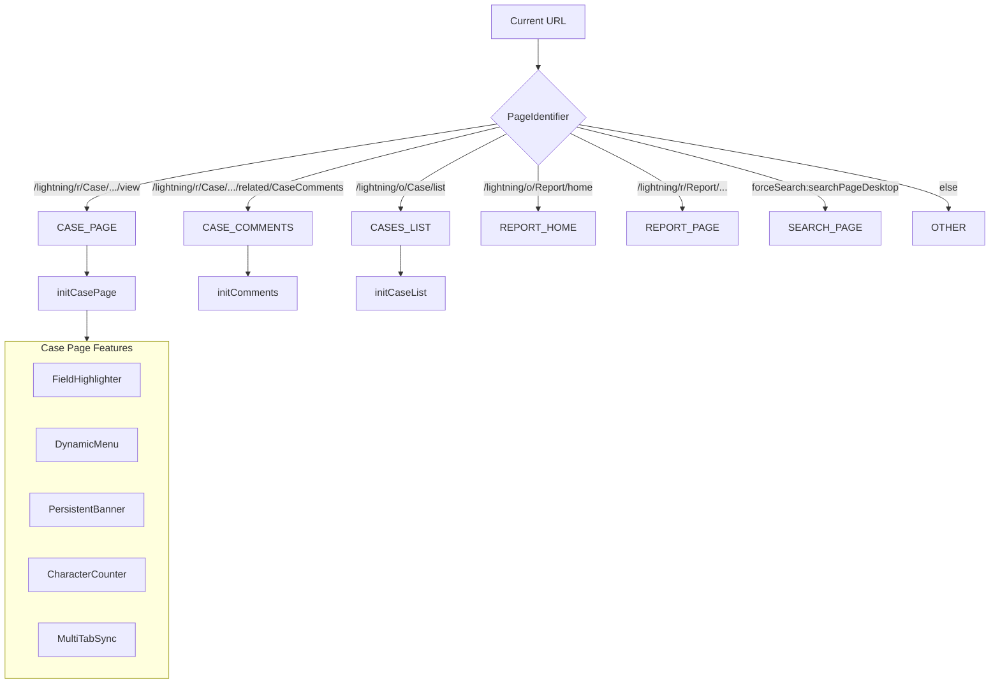

### Navigation Detection Signals

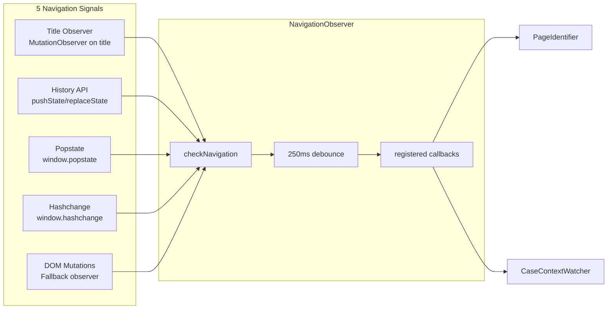

---

## Related Documentation

| Document | Purpose | Link |
|----------|---------|------|
| **PROJECT_RULES.md** | Comprehensive development rules | [PROJECT_RULES.md](PROJECT_RULES.md) |
| **BEST_PRACTICES.md** | Patterns, do's/don'ts, lessons | [BEST_PRACTICES.md](BEST_PRACTICES.md) |
| **FUNCTIONS.md** | Complete function catalog | [FUNCTIONS.md](FUNCTIONS.md) |
| **SELECTORS.md** | DOM selector registry | [SELECTORS.md](SELECTORS.md) |
| **DEPENDENCIES.md** | Module dependency graph | [DEPENDENCIES.md](DEPENDENCIES.md) |
| **CHANGES.md** | Change tracking with lessons | [CHANGES.md](CHANGES.md) |
| **ARCHITECTURE.md** | System architecture diagrams | [ARCHITECTURE.md](ARCHITECTURE.md) |
| **explaination.md** | Condensed knowledge base | [explaination.md](explaination.md) |
| **docs/minimal-knowledge-base.md** | Quick reference cheat sheet | [docs/minimal-knowledge-base.md](docs/minimal-knowledge-base.md) |
| **docs/condensed-dev-guide.md** | Developer guide | [docs/condensed-dev-guide.md](docs/condensed-dev-guide.md) |

---

## Development & Debugging Log

This section tracks iterative changes, attempts, failures, and fixes during development and maintenance.

### Log Entry Format

| Field | Description |
|-------|-------------|
| **Change/Attempt Description** | Concise summary of the change or investigation |
| **Status/Outcome** | `SUCCESS`, `FAILURE`, or `INVESTIGATION_COMPLETE` |
| **Failures Observed** | Actual behavior for failed attempts |
| **Actual Root Cause** | Verified cause (not assumptions) |
| **Fixes & Successful Attempts** | What resolved the issue |
| **Lessons Learned** | Takeaways for future work |

---

### Entry #1: Legacy Features Missing on ProQuest

| Field | Details |
|-------|---------|
| **Change/Attempt Description** | Ensure legacy case list features (row aging, status badges) work on ProQuest domain |
| **Status/Outcome** | `SUCCESS` |
| **Failures Observed** | Legacy functions (`handleCases`, `handleStatus`, `handleAnchors`) not available on ProQuest pages |
| **Actual Root Cause** | `content_script.js` was not loaded for ProQuest domain in manifest.json |
| **Fixes & Successful Attempts** | Added `content_script.js` to ProQuest content scripts block in manifest |
| **Lessons Learned** | When reusing legacy code across domains/instances, explicitly load it in manifest |

---

### Entry #2: Case Data Caching Causing Stale Data

| Field | Details |
|-------|---------|
| **Change/Attempt Description** | Address stale cache entries appearing after SPA navigation |
| **Status/Outcome** | `SUCCESS` |
| **Failures Observed** | Wrong case data displayed after rapid navigation; cache validation failing |
| **Actual Root Cause** | Case ID validation was distributed across multiple modules; could not keep up with Lightning SPA navigation timing |
| **Fixes & Successful Attempts** | Retired storage-heavy `CacheManager`, implemented `CaseContextWatcher` for head-based validation, controller now performs fresh extraction each time |
| **Lessons Learned** | Centralize page validation before storing data; SPA timing breaks traditional caches quickly; use single source of truth |

---

### Entry #3: Popup About Version Mismatch

| Field | Details |
|-------|---------|
| **Change/Attempt Description** | Fix version display in popup About tab |
| **Status/Outcome** | `SUCCESS` |
| **Failures Observed** | Displayed "v2.2" while manifest was at v4.0+ |
| **Actual Root Cause** | Version was hardcoded in HTML, not synced with manifest |
| **Fixes & Successful Attempts** | Replaced static text with `chrome.runtime.getManifest().version` |
| **Lessons Learned** | Use source-of-truth patterns; dynamic values reduce maintenance drift |

---

### Entry #4: CSS Selector Typo in Popup

| Field | Details |
|-------|---------|
| **Change/Attempt Description** | Fix invalid CSS causing style issues |
| **Status/Outcome** | `SUCCESS` |
| **Failures Observed** | Browser DevTools showing CSS parsing error |
| **Actual Root Cause** | Nested selector typo: `h2 { h2 { ... }` |
| **Fixes & Successful Attempts** | Removed duplicate `h2 {` wrapper |
| **Lessons Learned** | Small UI errors hide in static assets; use CSS linting and preview |

---

### Entry #5: Comprehensive Codebase Documentation

| Field | Details |
|-------|---------|
| **Change/Attempt Description** | Create comprehensive `explanation.md` with visual diagrams, component analysis, and debugging log |
| **Status/Outcome** | `SUCCESS` |
| **Failures Observed** | N/A (new documentation effort) |
| **Actual Root Cause** | N/A |
| **Fixes & Successful Attempts** | Analyzed 75+ modules, created Mermaid diagrams for architecture/data flow/storage, documented all components, patterns, and known issues |
| **Lessons Learned** | Systematic documentation requires understanding initialization order, event flows, and storage boundaries; visual diagrams accelerate onboarding |

---

### Template for New Entries

```markdown
### Entry #N: [Title]

| Field | Details |
|-------|---------|
| **Change/Attempt Description** | |
| **Status/Outcome** | `SUCCESS` / `FAILURE` / `INVESTIGATION_COMPLETE` |
| **Failures Observed** | |
| **Actual Root Cause** | |
| **Fixes & Successful Attempts** | |
| **Lessons Learned** | |
```

---

## Quality Gates

| Gate | Status | Notes |
|------|--------|-------|
| **Build** | ✅ PASS | No build system (static MV3 assets) |
| **Lint/Typecheck** | ⚠️ N/A | No configured linter/TS; recommend adding ESLint |
| **Tests** | ⚠️ N/A | No test harness; consider jsdom for critical helpers |
| **Documentation** | ✅ PASS | Comprehensive docs maintained |

---

## Next Steps

1. **Decide on `caseCommentExtractor.js`** — Include on ProQuest if comment export needed
2. **Add selector monitoring** — Automated checks for Salesforce DOM changes
3. **Implement automated tests** — jsdom setup for critical helper functions
4. **Add ESLint configuration** — Enforce consistent code style
5. **Create testing matrix** — Document page variants and locales to test

---

*If you spot discrepancies or want to enable additional features, see "Next Steps" and open an issue describing desired behavior and target pages.*
